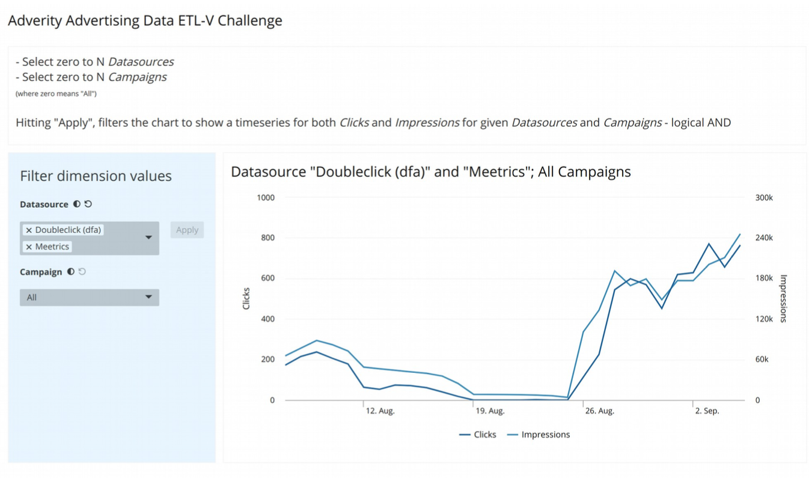

# Template-Frontend-Challenge

## Advertising Data ETL-V
You are going to write a simple web application, that fetches advertising data from a given endpoint to eventually visualize it on a simple interactive dashboard.  

For this, you need to first extract the data (a CSV file) from [http://adverity-challenge.s3-website-eu-west-1.amazonaws.com/DAMKBAoDBwoDBAkOBAYFCw.csv](http://adverity-challenge.s3-website-eu-west-1.amazonaws.com/DAMKBAoDBwoDBAkOBAYFCw.csv).

The data contains:
- one time dimension (*Date*)
- two regular dimensions (*Campaign*, *Datasource*)
- two metrics (*Clicks*, *Impressions*)

The goal is to provide a **simple dashboard**, that shows those **metrics** for given regular dimension values (as user input) **over time**. It could look like this:

Initially, no *Datasource* or *Campaign* is selected, hence the chart should show *Clicks* and *Impressions* over time for the entire data set. Users can then filter the dataset for both *Datasources* and *Campaigns*.  

Keep your UI/UX simple and only implement basic functionalities. The focus lies on the proper design of your application.  

If not told otherwise, use one of the following tech stacks:

## A) React Frontend only
Use react with:
- [create-react-app](https://github.com/facebook/create-react-app) to bootstrap your application
- [with a proper design of your components](https://facebook.github.io/react/docs/thinking-in-react.html)
- react hooks to manage state and side effects
- lodash to transform your data
- an idiomatic functional programming approach with javascript / es6
to implement the entire application as a pure frontend application - that fetches the data, does the heavy computation and visualizes the result.

## B) Django only
Use django (with django views) to extract, transform, load, query and visualize the data.

## C) Backend and frontend
Use either **django** or **micronaut** (with groovy or kotlin) to implement the backend.  

And **react** with [create-react-app](https://github.com/facebook/create-react-app) for the frontend.  

Carefully draw boundaries on who is responsible for what.
   
