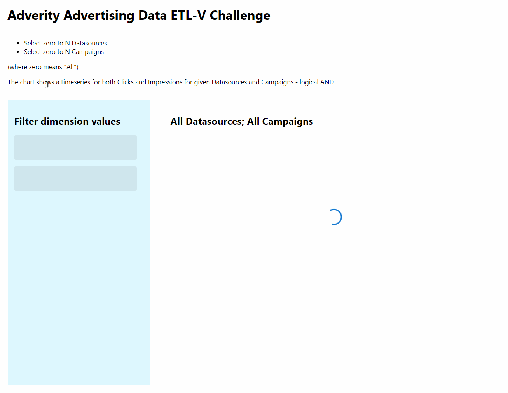

# Readme

This project implements the Adverity coding challenge. It is a simple web application written in React that parses CSV data and provides visualization in the form of a chart. Instructions on how to run the application in a development environment can be found in a separate README file inside the 'advertising-data-dashboard' directory.

## Tech stack 

- React
- TypeScript
- Lodash
- d3
- Styled Components
- MUI
- Jest
- React Testing Library

## Live demo
This project is available live on: https://adverity-kalkus.netlify.app/ 

## Preview

